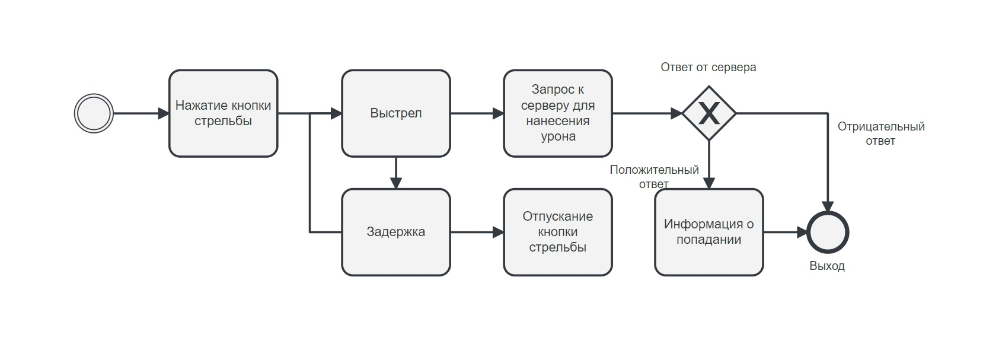

# GameServer
Basic server logic.

Logic damage


***

Oke now i show how use server API in you'r Unity project
# Client
* [Global Types](#global-types)
* [Get Start](#get-start)
  * [Unity](#unity)
    * [Install](#install)
    * [Initialization Server](#initialization)
    * [Sing Up and Log In](#sing-up--log-in)
    * [Joint and Create Room](#room)
    * [Rules Room](#rules)

## Global Types

| Type | Value | Description |
| --- |--- | --- |
| **Default Types** |
| `TYPE_NonPack` |`0`| If ur pack brouken or http |
| `TYPE_Get_User` |`4`| Get Pack with User info |
| **SingUP Types** |
| `TYPE_SingUp` | `1 `| Send pack for SingUP |
| **Login Types** |
| `TYPE_LogIn` | `3 `| Send pack for login |
| `TYPE_LogOut` | `10 `|Send Info about logout from server  |
|**CreateRoom Types** |
| `TYPE_CreateRoomS` | `5 `| Send pack for Create Rooom |
| `TYPE_CreateRoomR` | `6 `| Get pack with Room info  |
|**Update Room Types** |
| `TYPE_update_rules` | `7 `| Get pack with new Rules data |
| `TYPE_update_users` | `8 `| Get pack with new Users data in Room  |
|**Update Room Types** |
| `TYPE_i_wanna_info` | `9`| Send pack to get info about Rules  |
| `TYPE_i_wanna_users` | `11`|Send pack to get info All Users in room  |
| `TYPE_i_newUser` | `12`| Send pack with User Info |
| `TYPE_roomsend_auto_user ` | `13`| in process |
| `ROOM_Leave  ` | `14`| Room Leave |
| `ROOM_Send_Damage ` | `15`| Say server what you wanna send damage|
| `Room_Send_Transform   ` | `15`| Sent user Transform to server |
| `ADMIN ` | `1000`| For WPF aplication  `AdminBoard` |


***

# Get Start
## Unity
### Install
   1. Clone folder [Server](Client/Assets) into you'r Assets folder
   2. Add Server namespace
      ```cs
      namespace Server
      {
         <You'r Class : MonoBehaviour>
      }
      ```
### Initialization
First step declare variable CtServer   
```cs
private CtServer server;
```

Two step. Initialization variable server on _9000_ Port and additional **event listener** 
```cs
server = new CtServer(ip, 9000);

server.OnChangeUser += Server_OnChangeUser;
server.OnError += Server_OnError;
server.OnNewRoom += Server_OnNewRoom;

private void Server_OnNewRoom(object sender, EventArgs e){}

private void Server_OnError(object sender, string e){}

private void Server_OnChangeUser(object sender, EventArgs e){}

```
### Sing Up / Log In
Need SingUp or LogIn, for example:
```cs
void SingUp(string name, string email, string password);
/*
 *string name = User Name (min 4 symbol)
 *string email = User Email (@gmail.com and other)
 *string password = User Password (min 6 symbol)
 *
 */

public void LogIn(string email, string password);
/*
 *string email = User Email (@gmail.com and other)
 *string password = User Password (min 6 symbol)
 */
```
If user wanna sing up but they have account on the server, user well be auto log in on the server.

After Log In or Sing Up, `MainServer` Send to client data about User

If user Log in or Sing Up you can find open or create new room. If user wanna exit just call `Logout();`
```cs
public void Logout();
```
`Logout();` don't have argument because used internal variable `CurrentUser` 
### Room
If user wanna create Quick Match Just need call `CreateRoom()`
```cs
public void CreateRoom()
```
`CreateRoom()`don't have argument because used internal variable `CurrentUser`. After create room or join `MainServer` send data about room in internal variable `CurrentRoom`, You can get all info about Current Room.

After create room you can activate **event listner** `Server_OnUpdate`
For example:
```cs
server.CurrentRoom.OnUpdate += Server_OnUpdate;
```
this you can udpate user position
```cs
 private void Server_OnUpdate(object sender, User[] e)
 {
    foreach (User user in e)
    {
        if (!con(enemy, user))
        {
            var en = Instantiate(enPref);
            en.name = user.uId;
            en.transform.position = user.position;
            enemy.Add(en);
        }
     }
}
```

Perfect we get data about current user from  `MainServer` and get simple data about current room. Now we need get room rules.
### Rules
Rules have all data about room and players:

|Type | Name | Default Value| Description |
|-----|------|--------------|-------------|
| int | `BlueUser` | `5` | How much Player can be in Blue command |
| int | `RedUser` | `5` | How much Player can be in Red command |
| int | `Alive` | `1` | Available the Room now or no |
| int | `BlueScore` | `0` | Kills or other score for Blue command |
| int | `RedScore` | `0` | Kills or other score for Red command |
| int | `MatchState` | `0` | info about state match (0 - Waiting players,1-Play) |
| int | `timer` | `0` | Just match timer |

Well we get Rules and basic info about Room, We need get All users from the Room. You need use variable `CurrentRoom`.

for example `CurrentRoom` have only two methods:
```cs
public void GetNewRules();
public void GetNewUsers();
```
Don't have arguments and don't `return`. Just call `GetNewUsers()` if you wanna get users data.

##### >WARNING: `GetNewUsers()` all user data, not from you'r command/group because it's used for get firs table or other UI

##### Good Luck.


